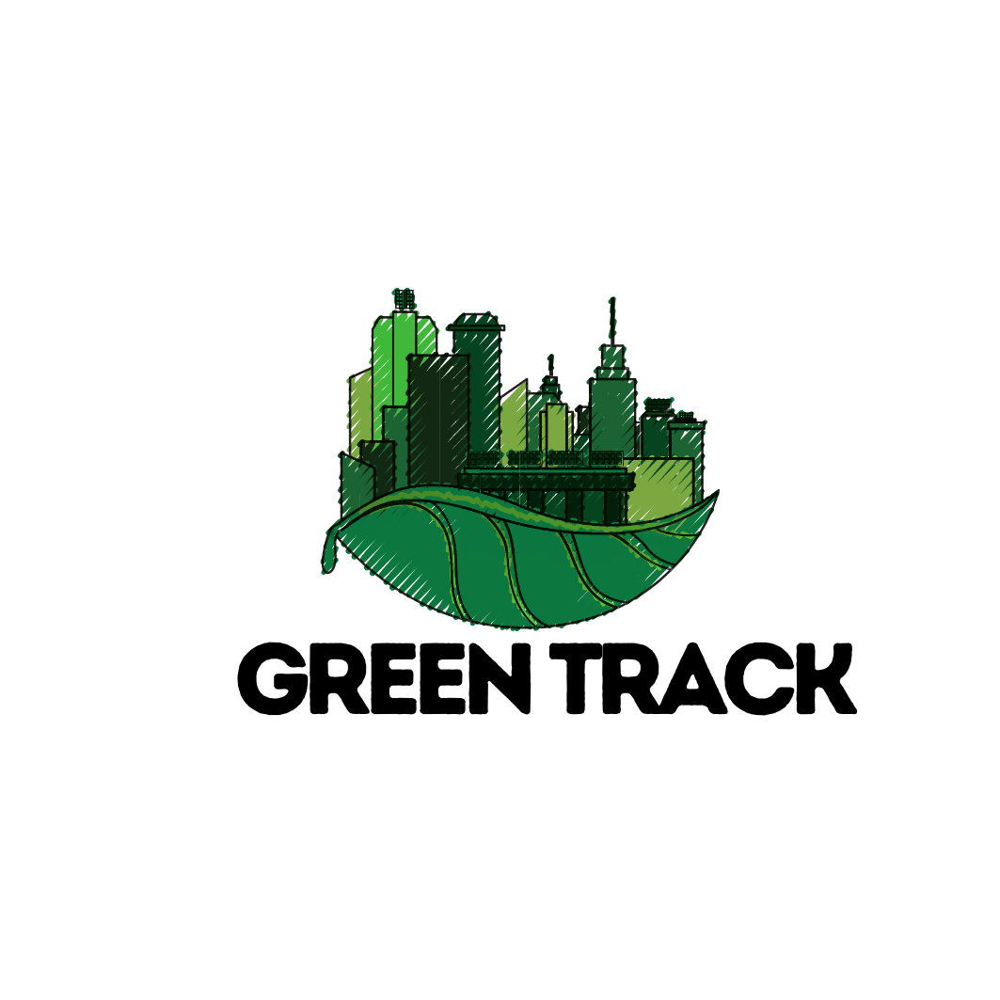

<p align="center">
  
</p>

# **GreenTrack: Fast-tracking Green Building Certification with AI**  

## **Table of Contents**  
1. [Introduction](#introduction)  
2. [The Problem](#the-problem)  
3. [The Solution: AI-Powered Certification](#the-solution-ai-powered-certification)  
4. [Getting Started](#getting-started)  
5. [Playground](#playground)
6. [Project Resources:Learn more about Green Track](#project-resources-learn-more-about-green-track)  
7. [Contributing](#contributing)  
8. [About Us](#about-us)  

## **Introduction**  

Project GreenTrack aims to create a stack of **AI-powered solutions** to **automate and streamline the process of green building certification**. This tool leverages **LLMs** to validate and verify key parameters outlined under green building rating standards, beginning with Green Rating for Integrated Habitat Assessment [(GRIHA Standards)](https://docs.google.com/spreadsheets/d/1ACInZjybHO91J53p1HrEaPxn8wKxdPAppkET2UgFlZw/edit?usp=sharing). The aim is to make the process more faster, efficient, and affordable.

### **The Problem**  

The current green building certification process is:  
- **Effort-Intensive:** Requires significant human involvement to track compliance, complete and verify paperwork.
- **Lengthy:** Involves multiple stakeholders, extensive documentation, and manual assessments.  
- **Expensive:** High costs associated with consulting, auditing, and approvals.  

These challenges act as **barriers to adoption**, making it difficult for builders, developers, and organizations to commit to sustainable construction practices. As a result, the widespread implementation of **green buildings** has been limited.

[Read more here ->](https://peopleplus.ai/blog/reimagining-green-building-certification-the-ai-powered-approach)

### **The Solution: AI-Powered Certification**  

**GreenTrack** envisions a future where **AI transforms the green certification process** into a fast, efficent and cost-effective experience. Our tool aims to:  

1. **Automate Compliance Checks:** AI-driven tools to verify compliance with minimal manual effort.  
2. **Assist Stakeholders Seamlessly:** Support for builders, consultants, auditors, ULBs, and certification bodies to quickly verify and demonstrate compliance with **GRIHA standards**.  
3. **Promote Green Building Adoption:** By reducing certification costs and time, we encourage more developers to pursue sustainable construction.

## **Getting Started**  

1. Clone the repository:
   ```
   git clone https://github.com/PeoplePlusAI/GreenTrack.git
   ```

2. The source code for the individual prototypes can be found in these folders:  
   - [Energy Rating Evaluator](./Energy%20Rating%20Evaluator)  
   - [Proximity Evaluator](./Proximity%20Evaluator)  
   - [Site Plan Analyzer](./Site%20Plan%20Analyzer)  

3. Follow the instructions in the README.md for the tool to run it.

## Playground
- [Proximity Evaluator](https://green-track-proximityevaluator.vercel.app/)
- [Energy Rating Evaluator](https://greentrack.pplus.ai/)

## **Project Resources: Learn more about Green Track**

- [Blog](https://peopleplus.ai/blog/reimagining-green-building-certification-the-ai-powered-approach)
- [Project Deck](https://drive.google.com/file/d/10o8E93Yp8EM6o7b3wSwI6dJFk7DbwMM2/view)
- [GRIHA AI Feasability Worksheet](https://docs.google.com/spreadsheets/d/1ACInZjybHO91J53p1HrEaPxn8wKxdPAppkET2UgFlZw/edit?usp=sharing)

## **Contributing**

We are looking for enthusiastic volunteers who can own pieces of this design puzzle. [Click Here](https://pplus.ai/openroles) to find parts of the project for you to take up and contribute to.

We welcome contributions from the community. To contribute to this project, please follow the guidelines outlined in [CONTRIBUTING.md](./CONTRIBUTING.md).

Please reach out to **[meghana@peopleplus.ai](mailto:meghana@peopleplus.ai)** or **[vishnu@peopleplus.ai](mailto:vishnu@peopleplus.ai)** if you are interested in learning more about the project and taking on any of these parts. 

## **About Us**  
People+ai connects do-ers, dreamers, tinkerers and innovators with ideas & resources to build an ecosystem that can empower a billion people to reach their potential. Learn more about other People+ai initiatives **[here](https://peopleplus.ai/)**.

Made with ♥️ for 🇮🇳 by Team People+ai
