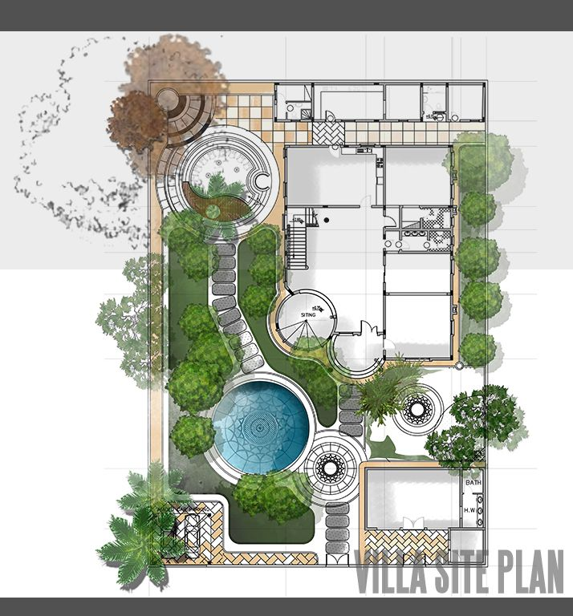
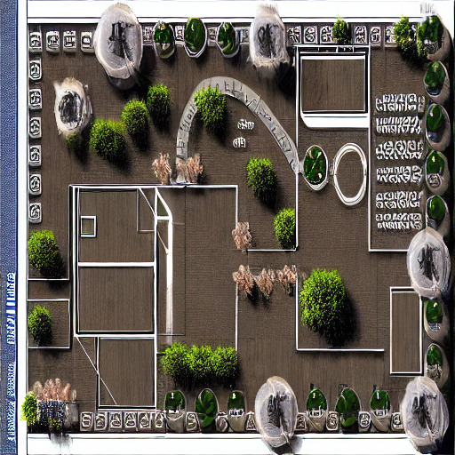

# Synthetic Site Map Generation with Stable Diffusion and ControlNet

This implementation provides a tool for generating synthetic site maps using a combination of edge detection and advanced image synthesis techniques. It leverages robust models, including ControlNet and Stable Diffusion, to transform processed site map edge data into realistic synthetic representations.

## **Challenges in Accessing Site Maps**

Site maps are often proprietary data, restricted due to their sensitive nature in architecture, urban planning, and real estate development. Acquiring such data for training or analysis typically requires partnerships, licensing agreements, or custom data generation. This scarcity of open-access site maps poses a significant barrier to research and development in automated mapping and architectural visualization.

This tool addresses these challenges by providing a means to generate synthetic site maps from edge-based approximations, enabling further experimentation and development without direct reliance on proprietary datasets.

## **Technical Overview**

The architecture of the system consists of three main components:

1. **Edge Detection Preprocessing:**
   - OpenCV's Canny edge detection algorithm processes grayscale site maps to extract structural edges. These edge maps form the backbone of the synthetic generation pipeline, providing precise guidance for the subsequent stages.

2. **ControlNet Integration:**
   - ControlNet, a specialized neural network model, integrates the edge map into the Stable Diffusion framework. This ensures that the generated outputs align closely with the spatial and structural cues from the input edge data.

3. **Stable Diffusion Pipeline:**
   - The Stable Diffusion model generates high-quality synthetic site maps by interpreting the input prompts and edge-based guidance. This diffusion-based architecture allows for fine-grained control over the stylistic and architectural elements of the output.

## **Comparison:**

| **Actual Site Map**                   | **Synthetic Site Map**                   |
|---------------------------------------|------------------------------------------|
|  |  |
